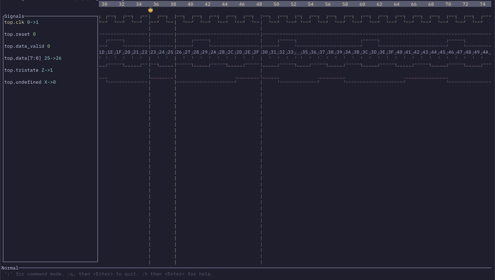

# DigiSurf: A TUI Signal Waveform Viewer

[](LICENSE)
[](https://github.com/SeanMcLoughlin/digisurf/actions/workflows/ci.yml)

⚠️ **ALPHA SOFTWARE WARNING**: DigiSurf is currently in alpha stage. Expect bugs, incomplete features, and potential breaking changes between versions. Use at your own risk.



DigiSurf is a terminal-based UI application for viewing and analyzing digital signal waveforms. It provides an intuitive interface for navigating through waveform data, placing markers, measuring timing, and examining signal values.

## Features

- **VCD File Support**: Load and view Value Change Dump (VCD) waveform files
- **Interactive Navigation**: Zoom in/out, pan, and navigate through waveforms
- **Markers**: Place primary and secondary markers to measure time intervals
- **Signal Selection**: Fuzzy finder for selecting which signals to display
- **Command Mode**: Vim-inspired command interface for advanced operations
- **Customizable**: Configure keybindings and UI settings via config file

## Usage

```bash
# Basic usage
digisurf -f yourfile.vcd

# With custom config file
digisurf -f yourfile.vcd -c custom_config.toml
```

## Keyboard Controls

- Arrow keys: Navigate signals and timeline
- `+`/`-`: Zoom in/out
- `0`: Zoom to full view
- `:`: Enter command mode
- Left click: Place primary marker
- Shift+Left click: Place secondary marker
- Click and drag: Zoom to selection

## Commands

- `:zoom <factor>` - Zoom to 1/factor of total
- `:zoomfull` (`:zf`) - Zoom to full view
- `:goto <time>` - Go to specific time
- `:marker <1|2> <time>` - Set marker
- `:findsignal` (`:fs`) - Open signal finder
- `:q` - Quit
- `:help` (`:h`) - Show help

## Installation

Install with cargo:

```bash
cargo install digisurf
```

Or clone this repo and build from source:

```bash
cargo build --release
```

## Configuration

DigiSurf looks for a configuration file at the standard location for your platform:
- Linux: `~/.config/digisurf/config.toml`
- macOS: `~/Library/Application Support/digisurf/config.toml`
- Windows: `%APPDATA%\digisurf\config\config.toml`

### Example Configuration

Here's a sample configuration file:

```toml
[ui]
signal_list_width = 20
marker_color_primary = "yellow"
marker_color_secondary = "white"
drag_color = "rgb(100,150,255)"

[keybindings]
# Navigation keys
up = { Char = "k" }           # Default: Up arrow
down = { Char = "j" }         # Default: Down arrow
left = { Char = "h" }         # Default: Left arrow
right = { Char = "l" }        # Default: Right arrow

# Zoom controls
zoom_in = { Char = "+" }
zoom_out = { Char = "-" }
zoom_full = { Char = "0" }

# Marker controls
delete_primary_marker = { Delete = {} }
delete_secondary_marker = { Backspace = {} }

# Mode switching
enter_command_mode = { Char = ":" }
enter_normal_mode = { Esc = {} }
execute_command = { Enter = {} }
```

You can customize any of these settings to match your preferences.
